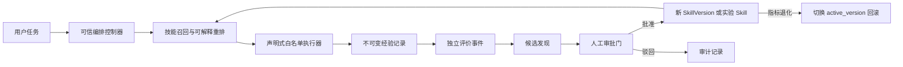

# 架构评审与落地说明

## 结论

原方案里“经验会沉淀成技能、组合会固化成工作流、每次执行都能留下学习证据”这个方向是对的。但技能库不能按“单条技能原地优化、永远只增不减、元技能可直接改自己”的方式实现。

本程序把产品定位调整为：

> 可审计、可回滚、有治理边界的本地自适应 Agent 运行时。

“进化”在这里有严格含义：从运行轨迹中发现重复模式、提出新的声明式技能或版本修订、汇总证据、经过审批后进入实验。它不等于意识、情感、主观体验或无限自我修改。

## 原方案需要修改的重点

### 1. “技能永久保留”应改成“版本历史不可丢失”

原地修改技能会让旧任务无法复现，也无法解释一次失败究竟用了哪个定义。本实现拆成：

- `Skill`：稳定身份、名称、类型、风险、生命周期。
- `SkillVersion`：不可变定义、父版本、内容哈希、来源候选、创建者。
- `active_version`：当前运行指针。
- `release_event`：每次启用和回滚的追加事件。

旧版本不删除；活跃目录可以弃用、归档或隔离。这样既保留历史，又不会让废弃技能污染每次检索。

### 2. 技能、工具、策略、经验必须分离

- 工具是人工注册的可信原子操作。
- 技能是工具或子技能的声明式编排。
- 策略属于可信控制核，负责选择、验证、停止和权限检查。
- 经验是发生过的事实，不是技能定义的一部分。

成功率、使用次数和平均耗时都从运行事件派生，不能写进技能定义后反复修改。

### 3. 自动学习只能生成候选

原方案的“达到阈值后自动入库”会把偶然相关、错误反馈和投毒经验固化。新的状态流是：

`经验 → 可信评价 → 模式 → 候选 → 审批 → 实验 → 更多验证 → 活跃`

首版只做到实验阶段。候选不会自动替换活跃版本。

### 4. 使用次数不等于熟练度

“越用越熟练”会造成路径依赖：越常被选中的技能会因为使用多而继续被选。本实现把使用次数压缩成饱和的弱特征，并用 `Beta(2,2)` 后验均值表示可靠度。零样本技能不会显示 100% 成功。

选择分为可解释分项：

- 触发正例、示例和描述匹配。
- 反例命中降权。
- 可信成功/失败的贝叶斯可靠度。
- 饱和后的使用证据。
- 延迟。
- 当前上下文。

以后应在硬约束过滤之后加入混合检索、置信区间、风险成本和 `abstain`。

### 5. 模型自评不是客观成功

技术执行成功只代表程序没有报错，不代表结果有用。评价单独保存为追加事件，来源包括：

- 用户反馈。
- 自动测试。
- 工具或环境断言。
- 模型辅助评价。

只有用户、测试和工具的高置信反馈可独立参与首版技能学习；模型自评被排除在候选生成依据之外。

### 6. 元技能不能无界修改自身

元选择和进化策略属于可信控制核。首版把它们登记为受保护、不可直接执行的技能记录，但实际代码不能被进化器重写。未来最多允许在固定边界内优化数值权重，并经过固定基准集与审批。

### 7. “情绪强度”改为显著性

情绪是拟人化且不可验证的字段。本程序使用 `salience`，表示任务对记忆处理的显著性。后续可由人工标记、失败严重性、成本、风险和新颖度组成。

### 8. 固定阈值只能是配置

“最近 100 条、7 天、重复 5 次、70% 成功、80% 匹配”不应成为架构真理。首版为了演示使用 3 条可信同标签经验生成候选；这只是开发配置，候选界面会明确显示没有独立留出集，不能据此升为稳定版。

### 9. 原文模块计数需修正

原文称“五大核心部分”，实际列出输入、注意、工作记忆、经验库、技能库、执行层和后台进化七类。本实现将其收敛为两个平面：

- 数据平面：输入、选择、执行、记录。
- 控制平面：评价、候选发现、审批、发布、回滚、审计。

## 当前系统结构



## 数据模型

### 技能与版本

- `skills`：稳定身份、类型、作用域、风险、生命周期、最新/活跃指针。
- `skill_versions`：不可变 JSON 契约、父版本、哈希、变更说明、来源候选。
- `skill_lifecycle_events`：启用、弃用、归档、隔离历史。
- `skill_release_events`：版本发布和回滚历史。

数据库触发器禁止更新或删除 `skill_versions`，禁止删除 `skills`。因此行为变化必须创建新版本。

### 经验与评价

- `experiences`：任务、输入、输出、模式键、标签、显著性、技术结果、耗时。
- `experience_skills`：当次真正使用的技能 ID、版本、位置、选择分数和解释。
- `skill_usage_events`：使用事实，用于派生统计。
- `evaluations`：评价来源、成功、分数、置信度和备注。

经验可以被标记为不参与进化，不会因此删除审计记录。

### 进化治理

- `candidates`：新技能、工作流或版本修订提案。
- `candidate_decisions`：批准/驳回及原因。
- `evolution_runs`：每次扫描的输入数、候选数、状态和摘要。
- `audit_events`：追加式治理事件。

## 技能契约

技能只允许声明式 pipeline：

```json
{
  "schema_version": 1,
  "executable": true,
  "triggers": {
    "include": ["总结", "摘要"],
    "examples": ["请总结这段内容"],
    "exclude": ["逐字翻译"]
  },
  "input_schema": {"type": "object", "required": ["text"]},
  "output_schema": {"type": "object"},
  "executor": {
    "type": "pipeline",
    "steps": [{"op": "summarize", "max_sentences": 3}]
  },
  "permissions": {"filesystem": [], "network": [], "commands": []}
}
```

组合技能使用 `skill_ref`，必须同时锁定 `skill_id` 与 `version`，避免子技能升级后偷偷改变工作流行为。

## 安全边界

当前执行器允许的操作只有：

- `normalize_text`
- `summarize`
- `extract_keywords`
- `make_checklist`
- `extract_decisions`
- `structure_notes`
- `format_template`
- `combine_outputs`
- `skill_ref`

所有新技能都要经过静态验证：

- 禁止文件、网络和命令权限。
- 禁止未注册操作。
- 禁止动态代码。
- 禁止未锁版本的子技能引用。
- 模板只允许固定字段替换，禁止格式宽度、类型转换和属性访问。
- 组合技能的风险级别不得低于任何子技能。

运行时还有第二层硬边界：整棵调用树共享最多调用数、步骤数、累计输出量和截止时间预算；每个输出也有独立上限，并检测递归和组合深度。因此分支型工作流不能靠逐层 50 步形成指数调用树。

任务入口会拆分显式复合子意图。只要某个非否定子任务没有被现有声明式技能覆盖，或需要外部读写、通信、命令等未授权能力，就返回 `unhandled`，不会静默只完成其中一部分。

这是一种“通过不提供危险能力来缩小攻击面”的 MVP 策略，不是操作系统级沙箱。

## 进化算法

当前成功路径：

1. 选取允许参与进化且技术执行成功的经验。
2. 读取用户、测试或工具的高置信评价。
3. 按显式标签或确定性关键词签名聚类。
4. 同模式至少有 3 条可信成功经验。
5. 提取最常见的、锁定版本的技能轨迹。
6. 生成声明式候选，附上经验 ID、来源分布和样本数。
7. 标记为 `evidence_only`，明确留出集为 0。
8. 人工批准后创建实验技能。

当前失败路径：

1. 同一技能版本积累至少 3 条同类、可信失败经验。
2. 反馈必须明确指出问题维度；“误路由”才把任务加入触发反例，“摘要过长”只收紧摘要句数，未知问题不会猜测性改写技能。
3. 扫描、候选写入与运行完成状态在一个数据库事务和同一评价快照内完成，失败时不遗留可审批的半成品候选。
4. 审批前不修改原技能；批准后创建新版本、切换活跃指针并保留旧版本。

等价模式不会重复生成候选；驳回原因永久记录。

## 指标修正

技能总数只是目录统计，不作为核心成长目标。首版优先显示：

- 可信评价样本数。
- 可信成功率及分子/分母。
- 未评价运行数。
- 平均延迟。
- 待审批候选数。
- 候选通过/驳回情况。
- 每次进化扫描的输入与产出。

生产版本还应增加：分任务成功率、Wilson 区间、版本相对基线增益、回归率、回滚率、路由准确率、拒答准确率、权限拦截率和成本。

## 后续路线

### P1：从可运行 MVP 到可靠实验平台

- 类型化 DAG、并行、条件分支、重试、fallback 和补偿。
- 独立训练/验证时间切分与真实历史回放。
- 候选与现有技能的相似度去重、合并建议。
- 工作流结果增益验证，而不是只看共现。
- 字段级脱敏、保留策略和法规删除。
- SQLite 租约任务队列和独立 worker。
- 稳定/实验双指针、shadow 与 canary。

### P2：有界自动优化

- 低风险技能的自动小流量实验。
- 上下文 bandit 路由和置信度校准。
- 指标恶化自动回滚和隔离。
- 元选择器数值权重的离线优化。
- 对抗测试、经验投毒检测和漂移告警。

在 P1/P2 的验证和安全边界完成前，不建议宣传为“自主元进化意识体”。
